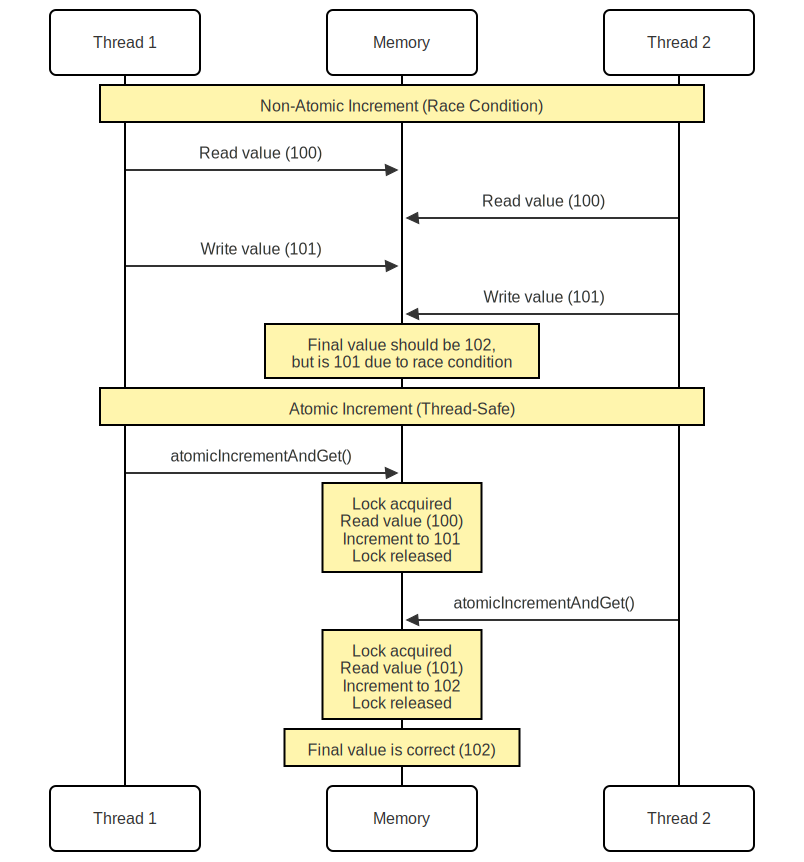

# Atomic Operations in Java and Kotlin
---

<div align="center">
  
  <p style="text-align:center;">Figure 2</p>
</div>

---

Atomic operations are fundamental building blocks in concurrent programming that ensure thread-safe updates to shared variables. Let's explore how they work and why they're essential for reliable multi-threaded applications.

## What Makes an Operation Atomic?

An atomic operation is one that executes as a single, uninterruptible unit. Just like a transaction in a database, either the entire operation completes successfully, or nothing changes at all.

## Primitive Types

✅ Basic types (`int`, `short`, `byte`, `char`, `float`, and `boolean`) have atomic read/write operations
❌ `long` and `double` require special handling:
⚠️ Not atomic on 32-bit systems
✅ Usually atomic on 64-bit systems
💡 Use `volatile` keyword to ensure atomicity

## Volatile Variables

🔄 Ensures immediate visibility across threads
📝 Guarantees atomic read/write operations
🔄 Prevents compiler optimizations that could break thread safety

## Atomic Classes

```java
AtomicInteger     // For integers
AtomicLong       // For long values
AtomicBoolean    // For boolean flags
AtomicReference  // For object references
```

Common atomic methods:
🔄 `get()` - Atomic read operation
➕ `incrementAndGet()` - Atomically increment and retrieve
↔️ `compareAndSet()` - Compare value and atomically set new value if match

## Hardware Support

Modern processors provide specialized instructions for atomic operations:

### Compare-and-Swap (CAS)

💪 Compares a memory location's value with expected value
💪 Only updates if values match
💪 Executes as a single, uninterruptible operation

### Load-Link/Store-Conditional

🔗 Load-link reads value and marks memory location
🔗 Store-conditional writes only if no other thread modified the location
🔗 Ensures atomicity through hardware-level locking

## Practical Example

```kotlin
import java.util.concurrent.atomic.AtomicInteger

object AtomicExample {
    private val counter = AtomicInteger(0)

    @JvmStatic
    fun main(args: Array<String>) {
        // Create two threads performing 1000 increments each
        val task = Runnable {
            for (i in 0 until 1000) {
                counter.incrementAndGet()
            }
        }

        val t1 = Thread(task)
        val t2 = Thread(task)

        // Start threads
        t1.start()
        t2.start()

        // Wait for completion
        t1.join()
        t2.join()

        // Should print 2000 (1000 increments × 2 threads)
        println("Final counter value: ${counter.get()}")
    }
}
```

## Best Practices

### Use atomic operations when:

🔒 Updating shared variables in multi-threaded environments
🔒 Implementing thread-safe counters or flags
🔒 Building lock-free data structures

### Avoid atomic operations when:

⚠️ Working with thread-local variables
⚠️ Performance is critical and synchronization isn't needed
⚠️ Using synchronized blocks would be more readable

Remember that atomic operations provide a powerful tool for building thread-safe applications, but they shouldn't replace proper synchronization entirely. Choose the right concurrency primitive based on your specific requirements and performance constraints.
